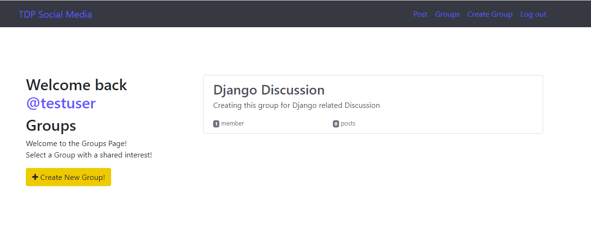
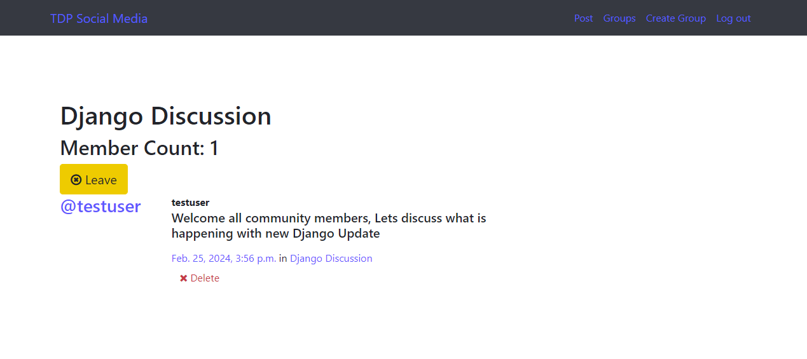

# Social Media Site with Django

This is an example project showcasing a Social Media Site built with Django.

## Features

- User registration and authentication
- Posting and sharing content
- Liking and commenting on posts
- Group creation and membership

## Installation

1. Clone the repository
2. Install the required dependencies: `pip install -r requirements.txt`
3. Set up the database: `python manage.py migrate`
4. Start the development server: `python manage.py runserver`

## Usage

1. Access the site in your web browser: `http://localhost:8000`
2. Register a new account or log in with an existing one.
3. Explore the different features of the site, such as creating posts, and joining groups.

## Screenshots

## Contributing

Contributions are welcome! If you find any issues or have suggestions for improvements, please open an issue or submit a pull request.

## License

This project is licensed under the [MIT License](LICENSE).